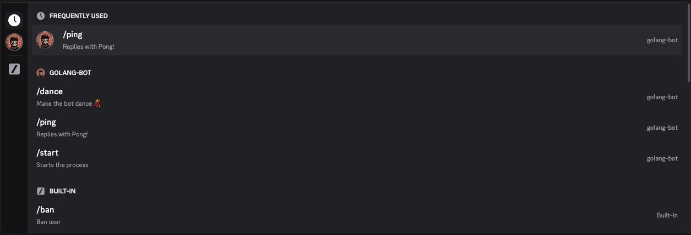

# Go Discord Bot

A simple Discord bot written in Go that implements slash commands.

## Bot Commands


*The bot provides slash commands for easy interaction*

## Features

- `/ping` - Bot responds with "Pong!"
- `/start` - Bot responds with a startup message
- `/dance` - Bot performs a dance emoji sequence


## Requirements

- Go 1.23 or higher
- Discord Bot Token

## Installation

1. Clone the repository:
   ```
   git clone https://github.com/yourusername/go-discord-bot.git
   cd go-discord-bot
   ```

2. Install dependencies:
   ```
   go mod download
   ```

3. Configure the bot:
   - Create a `config.json` file in the root directory with the following format:
     ```json
     {
       "Token": "YOUR_DISCORD_BOT_TOKEN",
       "BotPrefix": "!"
     }
     ```
   - Replace `YOUR_DISCORD_BOT_TOKEN` with your actual Discord bot token

## Running the Bot

```
go run main.go
```

Or build and run the executable:

```
go build
./go-discord-bot
```

## Project Structure

- `main.go` - Entry point of the application
- `config/config.go` - Configuration management
- `bot/bot.go` - Discord bot implementation with slash commands
- `config.json` - Bot configuration file

## How to Add New Commands

Add new commands to the `commands` slice in `bot/bot.go` and implement their handlers in the `onInteraction` function.

## Dependencies

- [discordgo](https://github.com/bwmarrin/discordgo) - Go package for the Discord API
